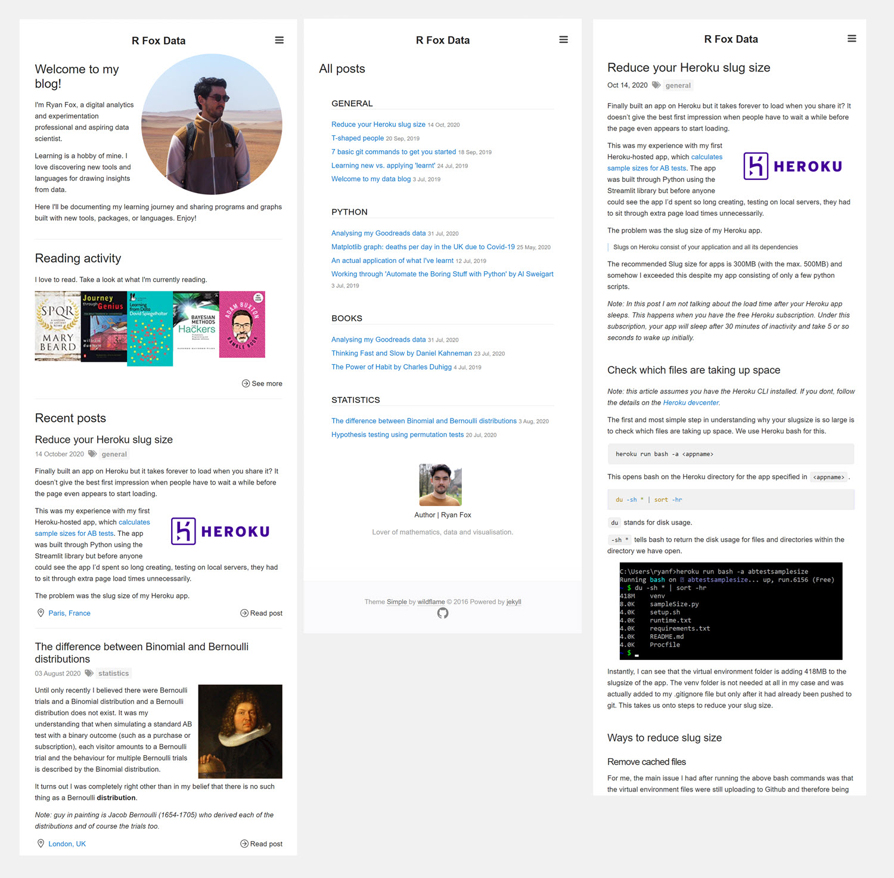

# R Fox Data

A personal blog where I can post about data science, data viz, statistics, mathematics, software engineering and books.

The site serves as a personal diary and public showcase of my the different projects I'm working on and my learning journey.

- Built with Jekyll
- Hosted on Github Pages

Visit the site at [RFoxData.co.uk](https://www.rfoxdata.co.uk).

<p align="center">
  
</p>

## Installation

The initial theme used was [Simple](https://jekyllthemes.io/theme/jekyll-simple) by [wild-flame](https://github.com/wild-flame). I've since made a thousand little tweaks to the theme around styling, sections, templates and general designs.

Read [here](https://github.com/github/personal-website/blob/master/README.md) about setting up a free blog on Github pages using Jekyll.

With Jekyll installed, fork this repository and use the following command to run the site locally.

```
jekyll serve
```
